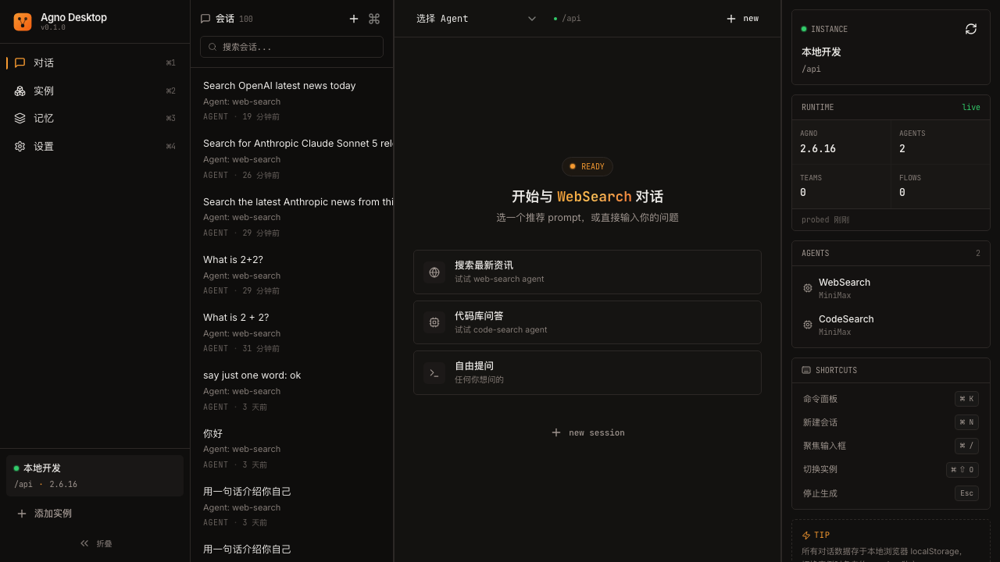

# Agno Desktop

> **多实例、本地优先的 AGNO AgentOS 对话台** — 一个连接任意 AGNO 实例的可视化前端。

[](https://react.dev) [](https://vitejs.dev) [](https://tailwindcss.com) [](https://tauri.app) [](https://docs.agno.com)

## 一句话定义

**打开浏览器 → 添加 AGNO 实例 → 选 agent → 聊天**，就能和任意 AGNO AgentOS 上的 agent 对话，看到完整的思考过程、工具调用、工具结果和引用来源。



## 核心能力

| 能力 | 描述 |
|------|------|
| **多 AGNO 实例** | 同时管理多个实例（dev / staging / prod），一键切换 |
| **Agent 选择** | 列出当前实例的所有 agent，每个 agent 独立 session |
| **流式对话** | SSE 实时渲染 token；思考、工具调用、结果分级展示 |
| **工具调用可视化** | 折叠卡片显示工具名 / 输入 / 状态 / 时长 / 结果 |
| **Web Search 结果** | 自动识别 `web_search` 返回的列表，渲染为可点击链接卡片 |
| **Markdown + 代码高亮** | GitHub Dark 代码块、表格、引用、链接 |
| **Session 管理** | 服务端 session 列表、搜索、重命名、删除 |
| **取消运行** | SSE AbortController 立即中断 + 服务端 cancel 兜底 |
| **HITL 审批** | agent 暂停时弹窗，提交工具执行结果后继续 |
| **断线重连** | SSE 事件索引恢复（AGNO `/resume` 端点） |
| **本地优先** | 所有数据 localStorage，零遥测 |
| **Vite 代理** | `/api/*` 代理到 AGNO，绕过 CORS |

## 快速开始

```bash
# 1. 安装依赖
bun install    # 或 npm install / pnpm install

# 2. 启动 dev server
bun run dev    # 默认 http://localhost:5173

# 3. 打开浏览器
open http://localhost:5173

# 4. 添加实例
# 在「实例」页面，点击「添加实例」
# 填入 base URL（如 http://127.0.0.1:8000）
# 检测到 localhost 时建议用 /api 走 Vite 代理

# 5. 切换到「对话」页，选择 agent，开始聊天
```

### 连接到远程实例

如果你的 AGNO 实例在远程（公司部署），需要：

1. **确保 JWT token**：prod 模式需要 `Authorization: Bearer <token>`
2. **CORS 允许**：如果不能改服务端 CORS，可以部署一个反向代理（Nginx / Caddy）放到同源

### ⚠️ CORS 问题（必看）

AGNO 服务端**默认只允许 `https://app.agno.com` 跨域**。如果你的前端不是
部署在 `app.agno.com`，直接请求会被浏览器 CORS 拦截，错误类似：

```
Access to fetch at 'http://127.0.0.1:8000/sessions?limit=100' from origin
'http://localhost:5174' has been blocked by CORS policy: No
'Access-Control-Allow-Origin' header is present on the requested resource.
```

应用会**自动识别 CORS 错误**并在 UI 里给出明确指引（不用再翻日志）。

**本地开发（推荐）**：用 Vite 代理绕过 CORS。

```bash
# 默认代理到 127.0.0.1:8000
bun run dev

# 远程内网 AGNO
AGNO_PROXY_TARGET=http://192.168.1.100:8000 bun run dev
```

添加实例时输入 `http://127.0.0.1:8000` 然后点 **"改用 /api"**，或直接输 `/api`。

**远程实例**：必须让后端放行你的 origin。三种方案：

1. **同源部署** — 把 Agno Desktop 部署到和 AGNO 实例相同的域名下
2. **公司内网** — 让 AGNO 运维把你的 origin 加到 CORS 白名单
3. **反代** — Nginx / Caddy 上加一层反代透传

### 自定义代理目标

默认 Vite 代理到 `http://127.0.0.1:8000`。要切换：

```bash
AGNO_PROXY_TARGET=http://192.168.1.100:8000 bun run dev
```

## 技术栈

| 维度 | 选型 |
|------|------|
| 框架 | React 19 + Vite 8 + TypeScript 6 |
| 样式 | Tailwind CSS 4 + CSS Variables + shadcn 风格组件 |
| 状态 | Zustand 5（4 个 store） |
| 路由 | React Router 7 |
| UI 组件 | 自建 shadcn 风格 + Radix UI primitives |
| Markdown | react-markdown + remark-gfm + remark-breaks + rehype-highlight |
| 代码高亮 | highlight.js（github-dark 主题） |
| 图标 | lucide-react |
| SSE | 原生 fetch + ReadableStream 解析 |
| 布局 | react-resizable-panels |
| 通知 | sonner |
| 持久化 | localStorage（无后端） |
| 包管理 | bun（也支持 npm/pnpm/yarn） |

## 项目结构

```
agno-desktop/
├── src/
│   ├── main.tsx                       # 入口
│   ├── App.tsx                        # 路由
│   ├── index.css                      # Tailwind + CSS Variables
│   ├── components/
│   │   ├── ui/                        # shadcn 风格基础组件
│   │   │   ├── button.tsx
│   │   │   ├── card.tsx
│   │   │   ├── dialog.tsx
│   │   │   ├── dropdown-menu.tsx
│   │   │   ├── input.tsx
│   │   │   ├── select.tsx
│   │   │   ├── tooltip.tsx
│   │   │   ├── badge.tsx
│   │   │   ├── scroll-area.tsx
│   │   │   ├── separator.tsx
│   │   │   ├── switch.tsx
│   │   │   ├── tabs.tsx
│   │   │   ├── popover.tsx
│   │   │   ├── label.tsx
│   │   │   ├── skeleton.tsx
│   │   │   └── resizable.tsx
│   │   ├── layout/
│   │   │   └── AppShell.tsx           # 主壳（左侧导航 + Outlet）
│   │   ├── instances/
│   │   │   ├── InstanceFormDialog.tsx # 添加/编辑实例对话框
│   │   │   └── InstancesPanel.tsx     # 实例状态侧边面板
│   │   ├── sessions/
│   │   │   └── SessionList.tsx        # 会话列表（搜索/重命名/删除）
│   │   ├── chat/
│   │   │   ├── ChatPanel.tsx          # 对话主面板
│   │   │   ├── MessageBubble.tsx      # 消息气泡（按 part 渲染）
│   │   │   ├── MessageInput.tsx       # 输入框（支持文件）
│   │   │   ├── ReasoningBlock.tsx     # 思考过程（可折叠）
│   │   │   ├── ToolCallCard.tsx       # 工具调用卡片
│   │   │   └── ApprovalDialog.tsx     # HITL 审批弹窗
│   │   ├── markdown/
│   │   │   ├── Markdown.tsx           # Markdown 渲染
│   │   │   └── CodeBlock.tsx          # 代码块
│   │   └── common/
│   │       └── Logo.tsx
│   ├── lib/
│   │   ├── agno-client.ts             # AGNO HTTP 客户端
│   │   ├── agno-types.ts              # AGNO API 类型
│   │   ├── sse-parser.ts              # SSE 解析器
│   │   ├── chat-runner.ts             # Chat 事件归约器
│   │   ├── message-types.ts           # 前端消息类型
│   │   ├── message-types-helpers.ts
│   │   ├── storage.ts                 # localStorage 工具
│   │   └── utils.ts                   # cn/format/debounce/copy
│   ├── stores/
│   │   ├── instances-store.ts         # AGNO 实例管理
│   │   ├── sessions-store.ts          # Session 列表
│   │   ├── chat-store.ts              # 消息 + runner
│   │   ├── settings-store.ts          # 应用设置
│   │   └── ui-store.ts                # 临时 UI 状态
│   ├── pages/
│   │   ├── ChatPage.tsx
│   │   ├── InstancesPage.tsx
│   │   ├── MemoryPage.tsx
│   │   ├── SettingsPage.tsx
│   │   ├── WelcomeScreen.tsx
│   │   └── NotFoundPage.tsx
│   ├── hooks/                          # (预留)
│   └── types/                          # (预留)
├── docs/
│   ├── design.md                       # 详细设计稿
│   ├── api-mapping.md                  # AGNO API ↔ 前端 UI 映射
│   └── screenshots/                    # 截图
├── public/
├── vite.config.ts                      # Vite 配置（含 /api 代理）
├── tailwind.config.js                  # (v4 用 CSS-first，无此文件)
└── package.json
```

## 路线图

| 版本 | 状态 | 范围 |
|------|------|------|
| v0.1 | ✅ 完成 | 聊天核心：多实例、SSE 流式、工具调用、Markdown、Session 管理 |
| v0.2 | 🚧 计划 | Memory 浏览、Knowledge 搜索、Trace 查看 |
| v1.0 | 📋 计划 | Approval 完整流、CRUD agents、Metrics、Settings 增强 |
| v2.0 | ✅ 完成 | Tauri 桌面壳（CORS 旁路、5.8 MB dmg），原生窗口 |

## 已知问题 / 限制

- **CORS 限制**：AGNO 服务端默认只允许 `app.agno.com` 跨域。本地实例必须用 `/api` 代理
- **背景色硬编码**：Markdown 代码块强制用 `github-dark`（不受主题切换影响）
- **没做 Memory UI**：v0.1 仅占位页，实际接口在 `agno-client.ts` 已实现
- **Approval 系统**：Run 级别 HITL 完整支持；Approval 端点列表未在 UI 暴露
- **断线重连**：UI 已记录 `last_event_index`，但 resume 触发逻辑未接

## 自动更新

桌面端集成了 [tauri-plugin-updater](https://v2.tauri.app/plugin/updater/)，开箱即用支持 GitHub Releases 渠道。

**当前默认配置**（`src-tauri/tauri.conf.json`）：

- endpoint: `https://github.com/yxc023/agno-desktop/releases/latest/download/latest.json`
- pubkey: 空（**必须生成**才可启用，见下文）
- 启动时自动检查 + 右下角 toast 通知 + 设置页「立即更新」

### 启用流程（自己发布时）

1. **生成签名密钥对**（只需一次）：
   ```bash
   cargo install tauri-cli --version "^2.0" --locked
   tauri signer generate -w ~/.tauri/keys/agno-desktop.key
   ```
   输出里以 `Public Key: dW50cnVz...` 开头的长串就是 pubkey。

2. **把 pubkey 填到 `tauri.conf.json`**：
   ```json
   "updater": {
     "active": true,
     "endpoints": ["https://github.com/<owner>/<repo>/releases/latest/download/latest.json"],
     "pubkey": "<paste your public key here>",
     "windows": { "installMode": "passive" }
   }
   ```

3. **修改 GitHub Actions 工作流**（`.github/workflows/release.yml`）：
   ```yaml
   - uses: tauri-apps/tauri-action@v0
     env:
       GITHUB_TOKEN: ${{ secrets.GITHUB_TOKEN }}
     with:
       tagName: v__VERSION__
       releaseName: "Agno Desktop v__VERSION__"
       releaseBody: "See CHANGELOG.md"
       releaseDraft: true
       prerelease: false
       updaterJsonPreferNsq: false
   ```
`tauri-action` 会自动：
    - 构建 macOS / Windows 平台 bundle
    - 生成 `latest.json`（含 url + 签名）
    - 上传为 GitHub Release draft

4. **本地测试 updater**：
   ```bash
   # 1) 在 GitHub 上 draft release 跑通前，可先用本地文件协议测试
   #    但 file:// 在 WebView2/WKWebView 默认禁用，需 https endpoint。
   # 2) 简易方案：起一个静态 server，把 latest.json + *.dmg/*.msi 放上去，
   #    把 endpoints 改成 http://localhost:8000/latest.json
   python3 -m http.server 8000 --directory dist-update
   # 3) 修改 tauri.conf.json 的 endpoints，bun run build:desktop
   ```

### 工作原理

- 启动后 5 秒（用户设置 `autoCheckUpdate=false` 时跳过），
  自动调用 `check()` 拉 `latest.json`，对比 `version` 字段
- 命中更新 → 右下角 toast「发现新版本 vX.Y.Z」，提供「立即更新 / 稍后」
- 点击「立即更新」 → 进度 dialog（百分比 + 已下载字节）
- 下载完成 + 签名校验通过：
  - macOS：自动重启应用并应用新 binary
  - Windows：弹安装器（installMode=passive 静默安装后用户手动重启）
- 错误（网络 / 签名失败）→ 错误 toast + 「重试」

### 浏览器 / 移动端行为

- 浏览器 dev (`vite dev`)：updater 钩子完全 no-op，不会触发任何 plugin 调用
- 移动端（iOS / Android）：走应用商店更新，不使用此 plugin
- 设置页中「立即检查」按钮在非桌面端自动 disabled + 显示提示

### 发布流程（CI 自动）

仓库配了 GitHub Actions，推 tag 即可自动出全平台产物：

#### 一次性配置

**1. 把密钥塞进 GitHub Secrets**

去 [Settings → Secrets and variables → Actions](https://github.com/yxc023/agno-desktop/settings/secrets/actions)，添加两个 secret：

| Secret 名 | 值 | 怎么拿 |
|-----------|---|--------|
| `TAURI_SIGNING_PRIVATE_KEY` | 私钥文件完整内容 | `cat ~/.tauri/keys/agno-desktop.key` |
| `TAURI_SIGNING_PRIVATE_KEY_PASSWORD` | 密码 | `cat ~/.tauri/keys/agno-desktop.key.password` |

**2. workflow 文件**（已在仓库里）

- `.github/workflows/ci.yml` — PR / push 闸门（typecheck + lint + test + build）
- `.github/workflows/release.yml` — tag 触发：3 平台 build + 自动签名 + draft release

#### 每次发版

```bash
# 1. bump version（三个文件必须保持一致）
#    package.json
#    src-tauri/Cargo.toml
#    src-tauri/tauri.conf.json

# 2. commit + push
git commit -am "chore: bump version to 0.0.X"
git push

# 3. 打 tag → 自动触发 workflow
git tag v0.0.X
git push --tags

# 4. 等待 15-25 分钟
#    GitHub → Actions 看进度
#    完成后会出现 draft release：https://github.com/yxc023/agno-desktop/releases/tag/v0.0.X

# 5. 审核 → 点 "Publish release"
```

#### 产物矩阵（当前）

| 平台 | Runner | 格式 | 备注 |
|------|--------|------|------|
| macOS | `macos-latest` | `*.dmg` | Apple Silicon only（aarch64） |
| Windows | `windows-latest` | `*.msi` | x86_64 |

> Linux 暂未打包——先聚焦 macOS / Windows。  
> **未做** Apple 代码签名 / 公证 — 首次启动需右键 → 打开绕过 Gatekeeper。  
> **未做** Apple Intel (x86_64) — 仅 Apple Silicon。如果有 Intel Mac 用户反馈，再加。

## 文档

- [设计稿](./docs/design.md) — 整体架构、UI 设计、数据流
- [API 映射表](./docs/api-mapping.md) — AGNO OpenAPI ↔ 前端实现

## 致谢

- [AGNO](https://docs.agno.com) — Agent SDK + AgentOS Runtime
- [shadcn/ui](https://ui.shadcn.com) — 组件设计灵感
- [Cursor](https://cursor.com) / [Claude Code](https://claude.com/product/claude-code) — agent UI 设计参考

---

v0.1 · 对话从 AGNO 服务端拉取，本地仅缓存实例配置
