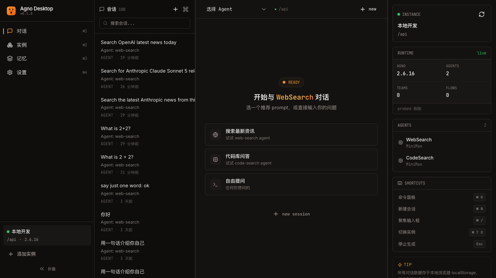

# Agno Desktop

> **多实例、本地优先的 AGNO AgentOS 对话台** — 一个连接任意 AGNO 实例的可视化前端。

[](https://react.dev) [](https://vitejs.dev) [](https://tailwindcss.com) [](https://tauri.app) [](https://docs.agno.com)

## 一句话定义

**打开应用 → 添加 AGNO 实例 → 选 agent → 聊天**，就能和任意 AGNO AgentOS 上的 agent 对话，看到完整的思考过程、工具调用、工具结果和引用来源。Web / 桌面两端一致，桌面端额外绕过浏览器 CORS。



## 核心能力

| 能力 | 描述 |
|------|------|
| **多 AGNO 实例** | 同时管理多个实例（dev / staging / prod），一键切换 |
| **每实例独立 `user_id`** | dev / staging / prod 的 session、memory 互不串扰 |
| **Agent 选择** | 列出当前实例的所有 agent，每个 agent 独立 session |
| **流式对话** | SSE 实时渲染 token；思考、工具调用、结果分级展示 |
| **消息虚拟化** | 1000+ 条消息的 session 只渲染 viewport 内的行（`@tanstack/react-virtual`） |
| **Markdown 流式节流** | streaming 期间 React 渲染频率从每 token 一次降到 ~40 fps |
| **Worker 代码高亮** | highlight.js 跑在 Web Worker，长 code block 不阻塞主线程 |
| **工具调用可视化** | 折叠卡片显示工具名 / 输入 / 状态 / 时长 / 结果 |
| **Web Search 结果** | 自动识别 `web_search` 返回的列表，渲染为可点击链接卡片 |
| **Sub-agent 抽屉** | Team / multi-agent 场景下点 sub message 弹出独立面板 |
| **HITL 审批** | agent 暂停时弹窗，提交工具执行结果后继续 |
| **取消运行** | SSE AbortController 立即中断 + 服务端 cancel 兜底 |
| **Session 管理** | 服务端 session 列表、搜索、重命名、删除 |
| **Markdown + 代码高亮** | GitHub Dark 代码块、表格、引用、链接 |
| **Hash 深链** | `#message-<id>` 跳转到指定消息，滚动位置自动同步到 URL |
| **桌面自动更新** | GitHub Releases 渠道，启动检测 + toast 提示 + 一键安装 |
| **本地优先** | 所有数据 localStorage，零遥测 |
| **Vite 代理 / WKWebView** | `/api/*` 代理到 AGNO，绕过浏览器 CORS（桌面端用 Tauri 直连） |

## 快速开始

```bash
# 1. 安装依赖
bun install    # 或 npm install / pnpm install

# 2. 启动 dev server（浏览器模式）
bun run dev    # 默认 http://127.0.0.1:5173

# 3. 启动桌面端 dev（Tauri WKWebView，跑在 :5180，避免 reload 抢焦点）
bun run dev:desktop

# 4. 打开浏览器 / 应用
open http://127.0.0.1:5173   # 浏览器 dev

# 5. 添加实例
#    在「实例」页面，点击「添加实例」
#    填入 base URL（如 http://127.0.0.1:8000）
#    检测到 localhost 时建议用 /api 走 Vite 代理

# 6. 切换到「对话」页，选择 agent，开始聊天
```

### 连接到远程实例

如果你的 AGNO 实例在远程（公司部署），需要：

1. **确保 JWT token**：prod 模式需要 `Authorization: Bearer <token>`
2. **CORS 允许**：如果不能改服务端 CORS，可以部署一个反向代理（Nginx / Caddy）放到同源

### 🍎 macOS 桌面端首次启动（重要）

桌面 `.dmg` **未做 Apple 代码签名 / 公证**（没有 Apple Developer 账号 / 证书）。
首次启动会被 Gatekeeper 拦下，弹「无法打开，因为 Apple 无法检查其是否有害」或
「文件已损坏」（取决于 macOS 版本）。三种解法任选其一：

```bash
# 方案 A：去 quarantine 属性（推荐，命令行一把过）
xattr -dr com.apple.quarantine "/Applications/Agno Desktop.app"
```

- **方案 B：右键 app → 打开 → 弹窗里再点「打开」**（一次性，记入 Gatekeeper 白名单）
- **方案 C：系统设置 → Privacy & Security → 滚到底点「Open Anyway」**

之后 macOS 会记住该 app 的信任状态，不再弹窗。彻底消除弹窗需要挂 Apple Developer 账号 + Developer ID Application 证书 + notarize——见 [已知问题](#已知问题--限制)。

### ⚠️ CORS 问题（必看）

AGNO 服务端**默认只允许 `https://app.agno.com` 跨域**。如果你的前端不是
部署在 `app.agno.com`，直接请求会被浏览器 CORS 拦截，错误类似：

```
Access to fetch at 'http://127.0.0.1:8000/sessions?limit=100' from origin
'http://127.0.0.1:5174' has been blocked by CORS policy: No
'Access-Control-Allow-Origin' header is present on the requested resource.
```

应用会**自动识别 CORS 错误**并在 UI 里给出明确指引（含「一键改用 /api 代理」按钮），不用再翻日志。

**本地开发（推荐）**：用 Vite 代理绕过 CORS。

```bash
# 默认代理到 127.0.0.1:8000
bun run dev

# 远程内网 AGNO
AGNO_PROXY_TARGET=http://192.168.1.100:8000 bun run dev
```

添加实例时输入 `http://127.0.0.1:8000` 然后点 **"改用 /api"**，或直接输 `/api`。

**桌面端**：Tauri WKWebView 不受浏览器 CORS 限制，可直接填 `http://192.168.x.x:8000` 等远程地址。

**远程实例 + 浏览器**：必须让后端放行你的 origin。三种方案：

1. **同源部署** — 把 Agno Desktop 部署到和 AGNO 实例相同的域名下
2. **公司内网** — 让 AGNO 运维把你的 origin 加到 CORS 白名单
3. **反代** — Nginx / Caddy 上加一层反代透传

## 技术栈

| 维度 | 选型 |
|------|------|
| 框架 | React 19 + React Router 7 + Vite 8 + TypeScript 6 |
| 桌面壳 | Tauri 2（updater / shell / process / http 插件） |
| 样式 | Tailwind CSS 4 + CSS Variables + shadcn 风格组件 |
| 状态 | Zustand 5（6 个 store：instances / sessions / chat / settings / ui / updater） |
| UI 组件 | 自建 shadcn 风格 + Radix UI primitives |
| 虚拟化 | `@tanstack/react-virtual` |
| Markdown | react-markdown + remark-gfm + remark-breaks + rehype-highlight |
| 代码高亮 | highlight.js（github-dark 主题，跑在 Web Worker） |
| 图标 | lucide-react |
| 布局 | react-resizable-panels |
| 通知 | sonner |
| SSE | 原生 fetch + ReadableStream 解析 |
| 持久化 | localStorage（无后端） |
| 包管理 | bun（也支持 npm/pnpm/yarn） |
| Lint / Test | oxlint / `bun:test` |

## 项目结构

```
agno-desktop/
├── src/
│   ├── main.tsx, App.tsx, index.css
│   ├── components/
│   │   ├── ui/                       # shadcn 风格基础组件
│   │   ├── layout/                   # AppShell, AppTitleBar
│   │   ├── chat/                     # ChatPanel, MessageBubble, VirtualMessageList, …
│   │   ├── sessions/                 # SessionList
│   │   ├── instances/                # InstanceFormDialog, InstancesPanel
│   │   ├── markdown/                 # Markdown, CodeBlock, MarkdownStream
│   │   └── common/                   # Logo, UpdateToast, UserIdSetupDialog, VerticalResizeHandle, useColumnResize
│   ├── lib/                          # 纯逻辑（无 React）
│   │   ├── agno-client.ts            # AGNO HTTP 客户端
│   │   ├── agno-types.ts             # AGNO API 类型
│   │   ├── sse-parser.ts             # SSE → 事件
│   │   ├── chat-runner.ts            # 事件归约器（AGNO event → message parts）
│   │   ├── chat-buffer.ts            # streaming 合并 + shadow map
│   │   ├── message-types*.ts         # 前端消息模型
│   │   ├── auto-scroll-controller.ts # 跟底/暂停状态机（test-only 独立）
│   │   ├── timeline-cache.ts         # VirtualMessageList 跨 mount 测量缓存
│   │   ├── paced-value.ts            # Markdown 流式节流
│   │   ├── model-context-windows.ts  # 模型 context window 查询（24h localStorage cache）
│   │   ├── highlight-client.ts + highlight.worker.ts  # 代码高亮 Worker
│   │   ├── updater.ts                # Tauri updater 包装
│   │   ├── user-id.ts                # 单一来源的 user_id 校验
│   │   ├── storage.ts                # localStorage helpers
│   │   ├── tauri.ts, tauri-fetch.ts  # 能力检测 + 原生 fetch fallback
│   │   ├── agent-name.ts             # agent 显示名解析
│   │   ├── tool-render-utils.ts      # 工具输出渲染 helper
│   │   ├── ime-composing.ts          # IME composition flag
│   │   ├── open-external-url.ts      # 外部链接打开（Tauri 壳里走 shell plugin）
│   │   └── utils.ts                  # cn / format / debounce / copy
│   ├── stores/                       # Zustand stores
│   │   ├── instances-store.ts        # AGNO 实例 CRUD + active 选择
│   │   ├── sessions-store.ts         # per-instance/agent session 列表
│   │   ├── chat-store.ts             # active session 消息 + runner
│   │   ├── settings-store.ts         # 用户偏好（主题、自动更新、宽度等）
│   │   ├── ui-store.ts               # 临时 UI 状态（面板、弹窗）
│   │   └── updater-store.ts          # updater 全局状态（避免组件 desync）
│   ├── pages/                        # ChatPage, InstancesPage, MemoryPage, SettingsPage, WelcomeScreen, NotFoundPage
│   ├── hooks/                        # useAutoScroll, useHashScroll, usePacedValue, useHighlight, useUpdater, useEffectiveTheme
│   └── types/                        # (预留)
├── src-tauri/                        # Rust 后端
│   ├── src/                          # main.rs / lib.rs + 自定义 install_update 命令
│   ├── capabilities/                 # ACL 文件
│   ├── tauri.conf.json
│   └── Cargo.toml
├── scripts/                          # build-desktop.ts, test.ts
├── tests/                            # bun:test，镜像 src/lib/<file>.ts
├── docs/                             # design.md, api-mapping.md, screenshots/
├── .github/workflows/                # ci.yml (typecheck + lint + test + build) / release.yml (3 平台 build + draft)
├── vite.config.ts                    # /api 代理 → AGNO
└── package.json                      # version 是 web 端的 source of truth
```

## 版本历史

完整变更见 [CHANGELOG.md](./CHANGELOG.md)。最近几个版本：

| 版本 | 日期 | 关键变更 |
|------|------|---------|
| 0.0.10 | 2026-07-26 | 每实例独立 `user_id`，session 互相隔离；sidebar streaming 即时刷新 |
| 0.0.9  | 2026-07-23 | 虚拟化消息列表 + Markdown 流式节流 + Worker 代码高亮 + hash 深链 + autoscroll 状态机 + SSE coalesce |
| 0.0.8  | —        | Tauri 桌面壳首版（绕过 CORS，5.8 MB dmg） |

## 已知问题 / 限制

- **macOS 桌面端未签名 / 未公证** — 首次启动需 `xattr -dr com.apple.quarantine` 或右键 → 打开绕过 Gatekeeper；彻底解决需要挂 Apple Developer 账号 + Developer ID Application 证书 + notarize（详见上文「macOS 首次启动」一节）。
- **AGNO CORS 限制** — 服务端默认只允许 `app.agno.com`。本地浏览器 dev 必须用 `/api` 代理；桌面端直连不受此限制。
- **Markdown 代码块强制 `github-dark`** — 不跟随应用主题切换（README / AGENTS 均已注明）。
- **Memory UI 占位** — `MemoryPage` 只展示当前 `user_id`，记忆列表未实现（`GET /memories` 接口已封装在 `agno-client.ts`，下一个版本加入）。
- **断线重连** — 已记录 `last_event_index` 持久化，UI 触发逻辑未接（依赖 AGNO `/resume` 端点稳定后再启用）。
- **macOS 仅 Apple Silicon** — 无 x86_64 产物；如果有 Intel Mac 用户反馈再加。
- **Tauri dev 端口是 5180**（不是 5173）— `tauri.conf.json` 的 `TAURI_DEV_PORT` 设的，WKWebView reload 时与浏览器 dev server 抢焦点，**不要**把两者统一。

## 自动更新

桌面端集成了 [tauri-plugin-updater](https://v2.tauri.app/plugin/updater/)，开箱即用支持 GitHub Releases 渠道。

**当前默认配置**（`src-tauri/tauri.conf.json`）：

- endpoint: `https://github.com/yxc023/agno-desktop/releases/latest/download/latest.json`
- pubkey: 已配置（构建时由 CI 注入对应私钥签名）
- 启动 5 秒后自动检查（`autoCheckUpdate=false` 时跳过）+ 右下角 toast + 设置页「立即更新」

### 工作原理

- 启动后 5 秒（用户设置 `autoCheckUpdate=false` 时跳过），
  自动调用 `check()` 拉 `latest.json`，对比 `version` 字段
- 命中更新 → 右下角 toast「发现新版本 vX.Y.Z」，提供「立即更新 / 稍后」
- 点击「立即更新」 → 进度 dialog（百分比 + 已下载字节）
- 下载完成 + 签名校验通过：
  - macOS：自动重启应用并应用新 binary（自定义 `install_update` 命令避开 `os error 18` cross-device link）
  - Windows：弹安装器（installMode=passive 静默安装后用户手动重启）
- 错误（网络 / 签名失败）→ 错误 toast + 「重试」

### 自建分发时的密钥配置

如果你 fork 出来自己发版，需要重新生成签名密钥对（一次）：

```bash
cargo install tauri-cli --version "^2.0" --locked
tauri signer generate -w ~/.tauri/keys/agno-desktop.key
```

把输出的 `Public Key: ...` 填到 `tauri.conf.json` 的 `updater.pubkey`，把私钥内容和密码塞到 GitHub Secrets（见下文）。

### 浏览器 / 移动端行为

- 浏览器 dev (`vite dev`)：updater 钩子完全 no-op，不会触发任何 plugin 调用
- 移动端（iOS / Android）：走应用商店更新，不使用此 plugin
- 设置页中「立即检查」按钮在非桌面端自动 disabled + 显示提示

### 发布流程（CI 自动）

仓库配了 GitHub Actions，推 tag 即可自动出全平台产物：

#### 一次性配置

**1. 把密钥塞进 GitHub Secrets**

去 [Settings → Secrets and variables → Actions](https://github.com/yxc023/agno-desktop/settings/secrets/actions)，添加：

| Secret 名 | 值 | 怎么拿 |
|-----------|---|--------|
| `TAURI_SIGNING_PRIVATE_KEY` | 私钥文件完整内容 | `cat ~/.tauri/keys/agno-desktop.key` |
| `TAURI_SIGNING_PRIVATE_KEY_PASSWORD` | 密码 | `cat ~/.tauri/keys/agno-desktop.key.password` |

**2. workflow 文件**（已在仓库里）

- `.github/workflows/ci.yml` — PR / push 闸门（typecheck + lint + test + build）
- `.github/workflows/release.yml` — tag 触发：3 平台 build + 自动签名 + draft release

#### 每次发版

```bash
# 1. bump version（三个文件必须保持一致）
#    package.json
#    src-tauri/Cargo.toml
#    src-tauri/tauri.conf.json

# 2. commit + push
git commit -am "chore: bump version to 0.0.X"
git push

# 3. 打 tag → 自动触发 workflow
git tag v0.0.X
git push --tags

# 4. 等待 15-25 分钟
#    GitHub → Actions 看进度
#    完成后会出现 draft release：https://github.com/yxc023/agno-desktop/releases/tag/v0.0.X

# 5. 审核 → 点 "Publish release"
```

#### 产物矩阵（当前）

| 平台 | Runner | 格式 | 备注 |
|------|--------|------|------|
| macOS | `macos-latest` | `*.dmg` | Apple Silicon only（aarch64），未签名 / 未公证 |
| Windows | `windows-latest` | `*.msi` | x86_64 |

> Linux 暂未打包——先聚焦 macOS / Windows。

## 文档

- [设计稿](./docs/design.md) — 整体架构、UI 设计、数据流
- [API 映射表](./docs/api-mapping.md) — AGNO OpenAPI ↔ 前端实现
- [CHANGELOG.md](./CHANGELOG.md) — 完整版本变更日志

## 致谢

- [AGNO](https://docs.agno.com) — Agent SDK + AgentOS Runtime
- [OpenCode](https://github.com/anomalyco/opencode) — `useAutoScroll` / `usePacedValue` / `timelineCache` 的设计灵感来源
- [shadcn/ui](https://ui.shadcn.com) — 组件设计灵感
- [Cursor](https://cursor.com) / [Claude Code](https://claude.com/product/claude-code) — agent UI 设计参考

---

v0.0.10 · 多实例 + per-instance user_id + 流式聊天 + 桌面壳